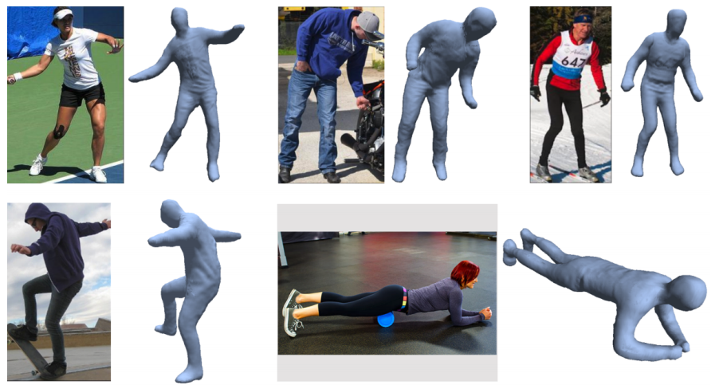
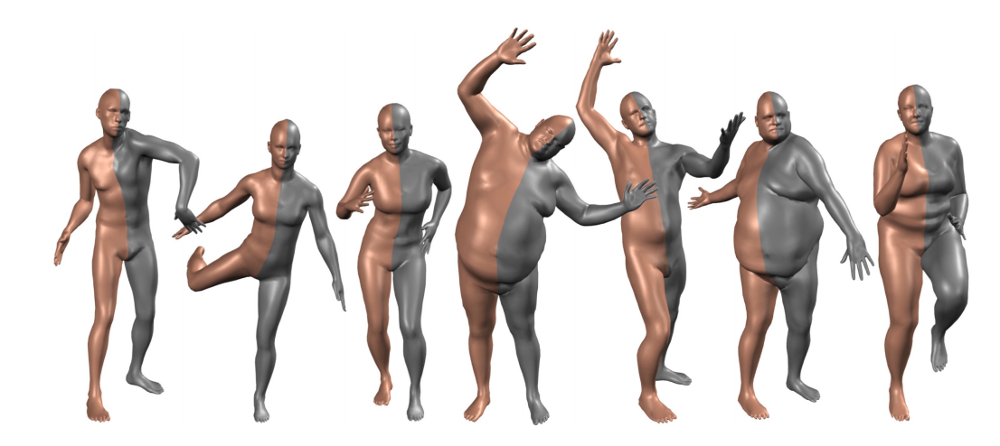

# Clothes-3D
Clothes research in 3D. 
Papers are ordered in ArXiv submission time (if applicable). Pls PR/Issue/Discussion.

__Content__

* [Clothes](#clothes)
* [Body](#body)
* [Softwares](#softwares)

## Clothes

* ##### CLOTH3D: Clothed 3D Humans
    https://arxiv.org/abs/1912.02792
    
    

* ##### A Neural Network for Detailed Human Depth Estimation from a Single Image
    https://arxiv.org/abs/1910.01275
    
    

* ##### 360-Degree Textures of People in Clothing from a Single Image
    https://arxiv.org/abs/1908.07117
    
    

* ##### Multi-Garment Net: Learning to Dress 3D People from Images
    https://arxiv.org/abs/1908.06903
    
    

* ##### 3D Virtual Garment Modeling from RGB Images
    https://arxiv.org/abs/1908.00114
    
    

* ##### Dressing 3D Humans using a Conditional Mesh-VAE-GAN
    https://arxiv.org/abs/1907.13615
    
    

* ##### PIFu: Pixel-Aligned Implicit Function for High-Resolution Clothed Human Digitization
    https://arxiv.org/abs/1905.05172
    
    

* ##### DeepHuman: 3D Human Reconstruction from a Single Image
    https://arxiv.org/abs/1903.06473
    
    
    
* ##### 3DPeople: Modeling the Geometry of Dressed Humans
    https://arxiv.org/abs/1904.04571
    
    
    
* ##### Learning to Reconstruct People in Clothing from a Single RGB Camera
    https://arxiv.org/abs/1903.05885
    
    

* ##### SiCloPe: Silhouette-Based Clothed People
    https://arxiv.org/abs/1901.00049
    
    

* ##### DeepWrinkles: Accurate and Realistic Clothing Modeling
    https://arxiv.org/abs/1808.03417
    
    

* ##### Learning a Shared Shape Space for Multimodal Garment Design
    https://arxiv.org/abs/1806.11335
    
    

## Body

* ##### SMPL: A Skinned Multi-Person Linear Model
  
    https://dl.acm.org/citation.cfm?doid=2816795.2818013 (2015)
    
    

## Softwares
* [Blender](https://www.blender.org/)
* [Clo3d](https://www.clo3d.com/)

## Other Useful Links

* https://github.com/lijiaman/awesome-3d-human