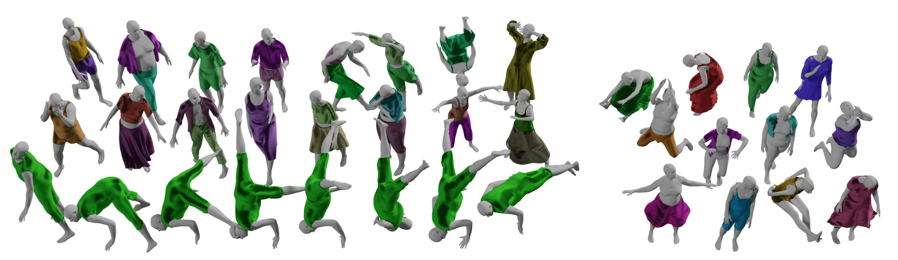
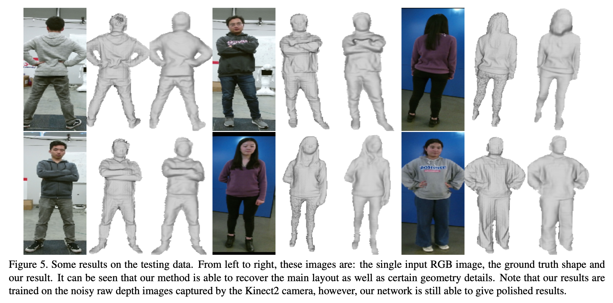
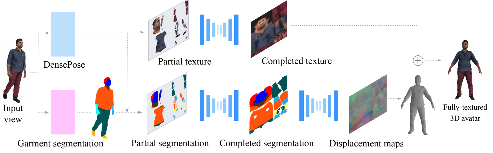
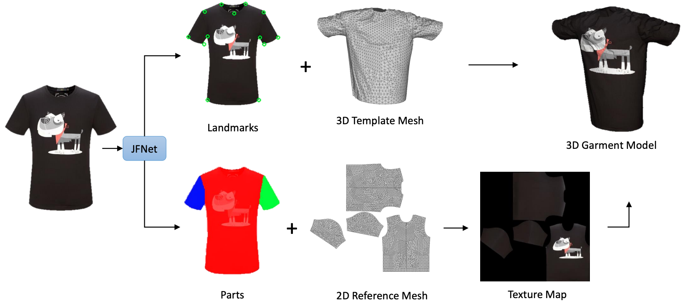
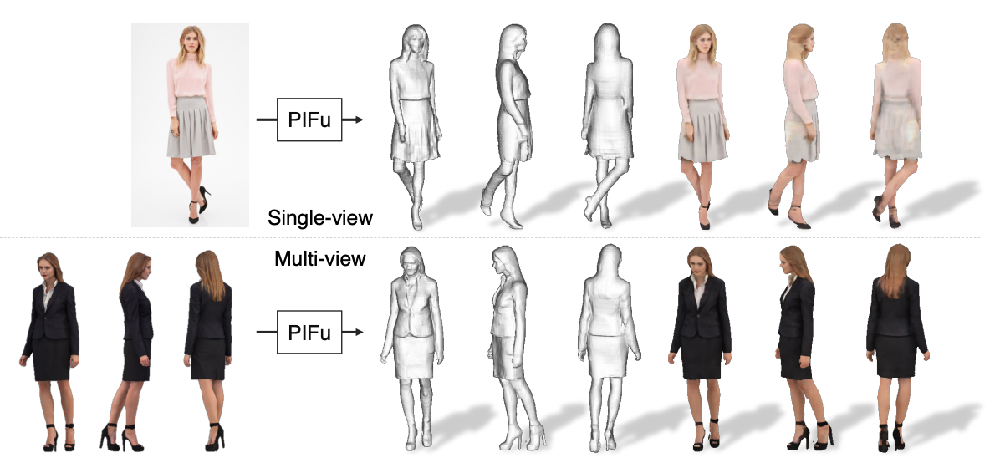
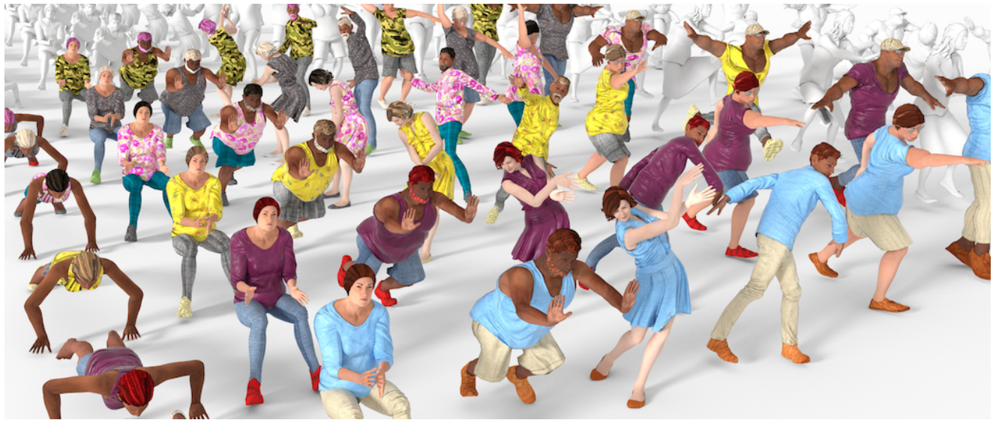
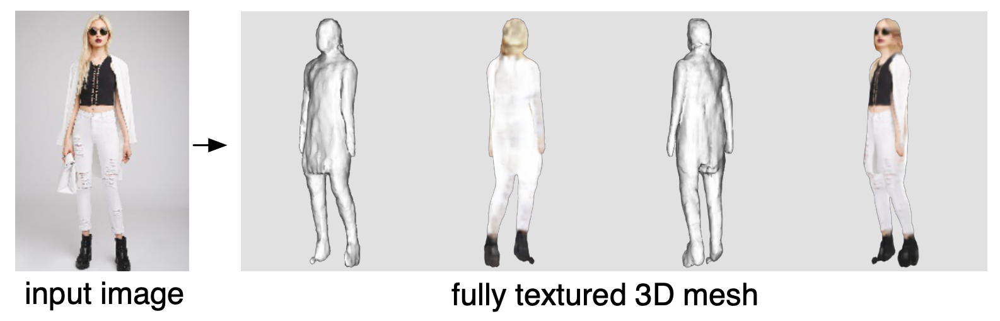
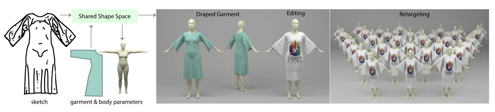

# Clothes-3D
Clothes research in 3D

* CLOTH3D: Clothed 3D Humans. https://arxiv.org/abs/1912.02792
    
* A Neural Network for Detailed Human Depth Estimation from a Single Image. https://arxiv.org/abs/1910.01275
    
* 360-Degree Textures of People in Clothing from a Single Image. https://arxiv.org/abs/1908.07117
    
* Multi-Garment Net: Learning to Dress 3D People from Images. https://arxiv.org/abs/1908.06903
    
* 3D Virtual Garment Modeling from RGB Images. https://arxiv.org/abs/1908.00114
    
* Dressing 3D Humans using a Conditional Mesh-VAE-GAN. https://arxiv.org/abs/1907.13615
* PIFu: Pixel-Aligned Implicit Function for High-Resolution Clothed Human Digitization. https://arxiv.org/abs/1905.05172
    
* 3DPeople: Modeling the Geometry of Dressed Humans. https://arxiv.org/abs/1904.04571
    
* SiCloPe: Silhouette-Based Clothed People. https://arxiv.org/abs/1901.00049
    
* Learning a Shared Shape Space for Multimodal Garment Design. https://arxiv.org/abs/1806.11335
    

